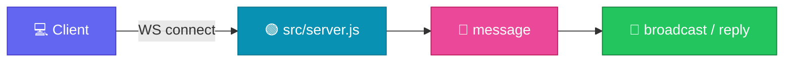

<p align="center">
  
</p>

<h1 align="center">websocket-starter</h1>

<p align="center">
  <strong>EN</strong> Minimal Node WebSocket server skeleton (ws)<br/>
  <strong>PT</strong> Skeleton mínimo de servidor WebSocket em Node (ws)
</p>

<p align="center">
  <a href="https://github.com/manansbdb/websocket-starter/blob/main/LICENSE"></a>
  
  
  <a href="#support--apoio"></a>
</p>

---

## What it does / Para que serve

| English | Português |
|---------|-----------|
| A **minimal WebSocket server** using the `ws` package — clone, `npm install`, `npm start`. | Um **servidor WebSocket mínimo** com o pacote `ws` — clona, `npm install`, `npm start`. |
| Ideal as a teaching skeleton or starting point for realtime features. | Ideal como skeleton didático ou ponto de partida para features realtime. |



---

## Install / Instalação

### 1) Clone / Clona

```bash
git clone https://github.com/manansbdb/websocket-starter.git
cd websocket-starter
```

### 2) Install & run / Instala e corre

```bash
npm install
npm start
# server listens (see src/server.js for port)
```

### Requirements / Requisitos

- Node.js 18+
- `npm`

---

## Quick start / Início rápido

```bash
git clone https://github.com/manansbdb/websocket-starter.git
cd websocket-starter
npm install && npm start
```

---

## Contents / Conteúdos

| Path | Purpose / Função |
|------|------------------|
| `package.json` | Scripts + `ws` dependency |
| `src/server.js` | Minimal WS server |
| `SUPPORT.md` | Donations / Doações |

---

## Project layout / Estrutura

```text
websocket-starter/
├── docs/banner.svg
├── package.json
├── src/server.js
├── SUPPORT.md
└── README.md
```

---

## Support / Apoio

Bitcoin donations welcome / Doações em Bitcoin bem-vindas:

```
bc1q0qfnlnxyum9u45stzxe0a7jnhtj4j0usfkqdjw
```

See [SUPPORT.md](./SUPPORT.md).

---

## License / Licença

[MIT](./LICENSE) © 2026 manansbdb
