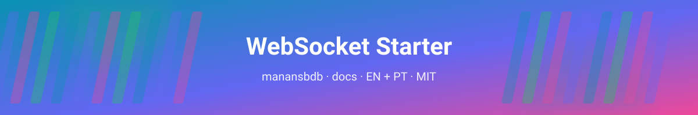
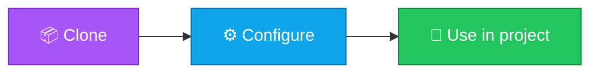

<p align="center">
  
</p>

<h1 align="center">websocket-starter</h1>

<p align="center">
  <strong>EN</strong> Minimal Node.js WebSocket server skeleton with documentation.<br/>
  <strong>PT</strong> Skeleton mínimo de servidor WebSocket em Node.js com documentação.
</p>

<p align="center">
  <a href="https://github.com/manansbdb/websocket-starter/blob/main/LICENSE"></a>
  
  
  <a href="#support--apoio"></a>
</p>

---

## What it does / Para que serve

| English | Português |
|---------|-----------|
| Minimal Node.js WebSocket server skeleton with documentation. | Skeleton mínimo de servidor WebSocket em Node.js com documentação. |



---

## Install / Instalação

### 1) Clone

```bash
git clone https://github.com/manansbdb/websocket-starter.git
cd websocket-starter
```

### Use / Usar

```bash
# open the files in this repo and copy what you need into your project
ls
```

### Requirements / Requisitos

- `git`
- No paid services required / Sem serviços pagos

---

## Files / Ficheiros

- `src/server.js` — server skeleton
- `package.json` — deps

---

## Support / Apoio

Bitcoin donations welcome / Doações em Bitcoin bem-vindas:

```
bc1q0qfnlnxyum9u45stzxe0a7jnhtj4j0usfkqdjw
```

**Network / Rede:** BTC (Bech32).

---

## License / Licença

[MIT](./LICENSE) © 2026 manansbdb
